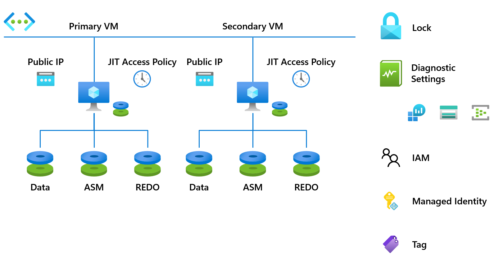

# Introduction

The code is intended as an example for automated deployment of two Azure Virtual Machines with Oracle Database Enterprise Edition 19c in a Data Guard configuration using Github Actions. The code is intended to be used as a starting point for your own deployment. The Bicep module for this deployment is located in the `bicep/bootstrap` directory.

 

## Variables

Overall if you wish to modify one or more variables in the module, you can do so by modifying the `bicep/bootstrap/data_guard/default/data_guard.bicepparam` file.

## Configure and run the workflow

First, configure your OpenID Connect as described [here](https://learn.microsoft.com/en-us/azure/developer/github/connect-from-azure?tabs=azure-portal%2Cwindows#use-the-azure-login-action-with-openid-connect).

Create a Github Secret in your repo with the name SSH_PRIVATE_KEY, containing the private key you wish to use for the deployment.

To deploy through GitHub actions, please refer to the [Data Guard GitHub Bicep workflow](../../.github/workflows/full-dg-bicep-deploy.yml) and follow the guidance below.

- Modify the following values in [Data Guard GitHub Bicep workflow](../../.github/workflows/full-dg-bicep-deploy.yml):
  - Change _AZ_LOCATION: "swedencentral"_, to your preferred Azure region
  - Change _AZ_RG_BASENAME: "Oracle-test"_, to your preferred resource group name prefix.
  - Change _VM_PRIMARY_NAME: "vm-primary-0"_, to your preferred name for the primary node in the data guard configuration.
  - Change _VM_SECONDARY_NAME: "vm-secondary-0"_, to your preferred name for the secondary node in the data guard configuration.
  - Change _ORCL_DB_NAME: "ORCL"_ to what the database will be named.
  - Change _SOFTWARE_RG: "binaryresource" to the resource group where the user assigned identity created to access the storage account with Oracle binaries is placed.
  - Change _USER_ASSIGNED_IDENTITY: "oraclelza"_ to the name of the user assigned identity created to access the storage account with Oracle binaries.
- Modify the following values in [Ansible variable file](../../ansible/bootstrap/oracle/group_vars/all/vars.yml):
  - Change _storage_account: oraclelzabin_ with the name of the storage account where the Oracle binaries are stored
  - Change _storage_container: oraclebinaries_ with the name of the container on the storage account where the Oracle binaries are stored.
- After modifying the values, merge the changes to the main branch of your repo.
- Go to GitHub actions and run the action *Deploy an Oracle DB in a Data Guard configuration on Azure with Bicep and Ansible*
