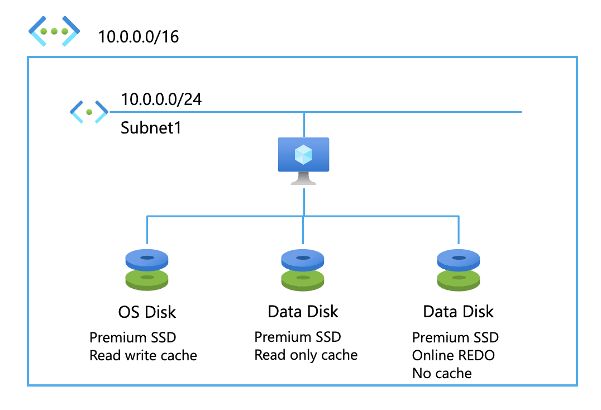

# Introduction

The code is intended as an example for automated deployment of a single instance virtual machine with Oracle Database Enterprise Edition 19c using Github Actions. The code is intended to be used as a starting point for your own deployment. The Bicep module for this deployment is located in the `bicep/bootstrap` directory.

 

## Variables

Overall if you wish to modify one or more variables in the module, you can do so by modifying the `bicep/bootstrap/single_instance/default/single_instance.bicepparam` file.

## Configure and run the workflow

First, configure your OpenID Connect as described [here](https://learn.microsoft.com/en-us/azure/developer/github/connect-from-azure?tabs=azure-portal%2Cwindows#use-the-azure-login-action-with-openid-connect).

Create a Github Secret in your repo with the name SSH_PRIVATE_KEY, containing the private key you wish to use for the deployment.

To deploy through GitHub actions, please refer to the [Single instance GitHub Bicep workflow](../blob/main/.github/workflows/full-si-bicep-deploy.yml) and follow the guidance below.

- Modify the following values in [Single instance GitHub Bicep workflow](../blob/main/.github/workflows/full-si-bicep-deploy.yml):
  - Change _AZ_LOCATION: "swedencentral"_, to your preferred Azure region
  - Change _AZ_RG_BASENAME: "Oracle-test"_, to your preferred resource group name prefix.
- Go to GitHub actions and run the action *Deploy Single Instance Oracle DB on Azure with Bicep and Ansible*
